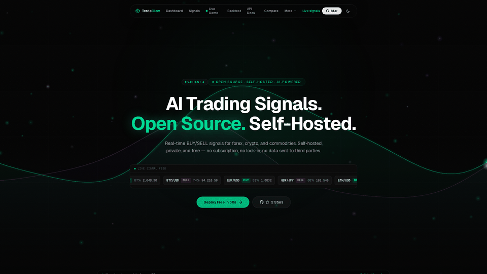

<div align="center">


<a href="https://tradeclaw.win/dashboard">
  
</a>

<h1>TradeClaw</h1>
<p><strong>オープンソース AI トレーディングシグナルプラットフォーム。セルフホスト対応。永久無料。</strong></p>
<p>RSI · MACD · EMA · ボリンジャーバンド · ストキャスティクス — すべてを1つのダッシュボードに。2分でデプロイ完了。</p>

[](https://github.com/naimkatiman/tradeclaw/stargazers)
[](https://opensource.org/licenses/MIT)
[](https://github.com/naimkatiman/tradeclaw/commits/main)
[](https://hub.docker.com/r/tradeclaw/tradeclaw)
[](https://tradeclaw.win/dashboard)
[](https://github.com/marketplace/actions/tradeclaw-signal)

**[🚀 ライブデモ](https://tradeclaw.win/dashboard)** · **[📡 APIドキュメント](https://tradeclaw.win/api-docs)** · **[🤝 コントリビュート](https://tradeclaw.win/contribute)**

🌍 [English](README.md) | [中文](README.zh.md) | **日本語** | [한국어](README.ko.md)

</div>

---

## なぜ TradeClaw なのか？

- **サブスクリプション不要** — セルフホストで、データは自分で管理、費用は $0
- **リアルシグナル** — RSI/MACD/EMA/ボリンジャー/ストキャスティクスのコンフルエンススコアリング、Binance + Yahoo Finance からリアルタイム取得
- **開発者ファースト** — REST API、CLI（`npx tradeclaw`）、Webhooks、プラグイン、AIアシスタント向け MCP サーバー
- **120以上のページ** — ダッシュボード、バックテスト、スクリーナー、ペーパートレーディング、Telegram ボット、シグナルリプレイなど

## クイックスタート

```bash
# オプション1：Docker Hub（最速 — クローン不要）
docker pull tradeclaw/tradeclaw
docker run -p 3000:3000 tradeclaw/tradeclaw
# → hub.docker.com/r/tradeclaw/tradeclaw (linux/amd64 + linux/arm64)

# オプション1b：Docker Compose（.env 付き）
git clone https://github.com/naimkatiman/tradeclaw
cd tradeclaw
cp .env.example .env
sed -i "s/^DB_PASSWORD=.*/DB_PASSWORD=$(openssl rand -hex 16)/" .env
sed -i "s/^AUTH_SECRET=.*/AUTH_SECRET=$(openssl rand -hex 32)/" .env
docker compose up -d

# オプション2：npx デモ（インストール不要）
npx tradeclaw-demo

# オプション3：CLI
npx tradeclaw signals --pair BTCUSD --limit 5
```

[http://localhost:3000](http://localhost:3000) を開く — ダッシュボードが起動しています。

[](https://railway.app/new/template?template=https://github.com/naimkatiman/tradeclaw)
[](https://vercel.com/new/clone?repository-url=https://github.com/naimkatiman/tradeclaw/tree/main/apps/web)

## 機能一覧

| カテゴリ | 内容 |
|---------|------|
| 📊 **シグナル** | RSI、MACD、EMA、ボリンジャー、ストキャスティクス — 5指標コンフルエンススコアリング |
| 🎯 **対応資産** | BTCUSD、ETHUSD、XAUUSD、XAGUSD、EURUSD、GBPUSD、USDJPY ほか |
| ⏱️ **時間足** | M5、M15、H1、H4、D1 + マルチタイムフレームコンフルエンスビュー |
| 📱 **モバイル** | レスポンシブ PWA — インストール可能、オフライン対応 |
| 🤖 **自動化** | Telegram ボット、Discord/Slack Webhooks、カスタム JS プラグイン |
| 🔌 **API** | REST API、API キー、レート制限、shields.io バッジ対応 |
| 🖥️ **CLI** | `npx tradeclaw signals` — ターミナルからシグナルを取得 |
| 🧠 **AI** | Claude Desktop 向け MCP サーバー、AI シグナル解説 |
| 📈 **バックテスト** | Canvas チャート（RSI/MACD オーバーレイ付き）、CSV エクスポート、月次ヒートマップ |
| 🎮 **ペーパートレード** | 仮想 $10k ポートフォリオ、シグナル自動追従、エクイティカーブ |

## TradeClaw と他サービスの比較

| 機能 | TradeClaw | TradingView | 3Commas |
|------|-----------|-------------|---------|
| セルフホスト | ✅ | ❌ | ❌ |
| オープンソース | ✅ | ❌ | ❌ |
| 永久無料 | ✅ | ❌（$15/月〜） | ❌（$29/月〜） |
| REST API | ✅ | ❌（有料） | ✅ |
| Telegram ボット | ✅ 内蔵 | ❌ | ✅ 有料 |
| カスタムプラグイン | ✅ | Pine Script | ❌ |
| MCP / AIネイティブ | ✅ | ❌ | ❌ |

## 技術スタック

Next.js 15 · TypeScript 5 · Tailwind CSS v4 · Node.js 22 · Docker

## ポートフォリオの埋め込み

埋め込みウィジェットで、ペーパートレーディングのパフォーマンスをどこでも共有できます：

```html
<!-- Iframe 埋め込み（ダークテーマ、30秒ごとに自動更新） -->
<iframe src="https://tradeclaw.win/api/widget/portfolio/embed?theme=dark" width="320" height="200" frameborder="0" style="border-radius:12px"></iframe>
```

```markdown
<!-- Shields.io バッジ（README 用） -->
[](https://tradeclaw.win/paper-trading)
```

```markdown
<!-- SVG バッジ（外部サービス不要） -->
[](https://tradeclaw.win/paper-trading)
```

JSON API：`GET /api/widget/portfolio` — 残高、純資産、損益、勝率を返します。[ウィジェットギャラリー &rarr;](https://tradeclaw.win/widgets)

## リアルタイムシグナルバッジ

BTC、ETH、ゴールドのリアルタイムシグナルバッジを README に直接埋め込めます — 5分ごとに自動更新、API キー不要。

[](https://tradeclaw.win/signal/BTCUSD-H1-BUY)
[](https://tradeclaw.win/signal/ETHUSD-H1-BUY)
[](https://tradeclaw.win/signal/XAUUSD-H1-BUY)
[](https://tradeclaw.win/signal/EURUSD-H1-BUY)

```markdown
<!-- 任意の README に貼り付け — ライブの買い/売りシグナルと信頼度%を表示 -->
[](https://tradeclaw.win)
[](https://tradeclaw.win)
[](https://tradeclaw.win)
```

```markdown
<!-- または shields.io 経由（キャッシュバスティング対応） -->
[](https://tradeclaw.win)
[](https://tradeclaw.win)
```

URL フォーマット：`https://tradeclaw.win/api/badge/{PAIR}?tf={H1|H4|D1}` · [全バッジペア一覧 &rarr;](https://tradeclaw.win/badge)

## GitHub Action

CI/CD パイプラインでリアルタイムシグナルを取得：

```yaml
- name: Get BTC signal
  uses: naimkatiman/tradeclaw/packages/tradeclaw-action@main
  id: signal
  with:
    pair: BTCUSD
    timeframe: H1
    min_confidence: 70

- name: Deploy if confident
  if: success()
  run: npm run deploy
```

市場状況に基づいてデプロイを制御、定期シグナルチェックの実行、マトリクス戦略で複数ペアをスキャン。[Action ドキュメント &rarr;](https://tradeclaw.win/action) &middot; [マーケットプレイス &rarr;](https://github.com/marketplace/actions/tradeclaw-signal)

## Discord ボット

TradeClaw を Discord サーバーに追加して、リアルタイムのトレーディングシグナルを受け取りましょう：

```bash
cd packages/tradeclaw-discord
npm install
DISCORD_BOT_TOKEN=your_token node bin/bot.js
```

**スラッシュコマンド：** `/signal`、`/leaderboard`、`/health`、`/subscribe`、`/unsubscribe`、`/help`

[Discord セットアップガイド &rarr;](https://tradeclaw.win/discord) &middot; [ボットソースコード &rarr;](https://github.com/naimkatiman/tradeclaw/tree/main/packages/tradeclaw-discord)

## コントリビュート

PR を歓迎します！**[初心者向け Issue](https://github.com/naimkatiman/tradeclaw/labels/good%20first%20issue)** と **[コントリビューションガイド](https://tradeclaw.win/contribute)** をご確認ください。

```
⭐ このリポジトリにスターを付けて、TradeClaw をもっと多くの人に届けましょう
```

## プロジェクトを応援する

[](https://github.com/sponsors/naimkatiman)
[](https://buymeacoffee.com/naimkatiman)

---

<div align="center">
<sub>MIT ライセンス · ⚡ で構築 · <a href="https://tradeclaw.win">tradeclaw.win</a></sub>
</div>
