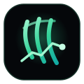

<div align="center">



# TradeClaw

**Open-source AI trading signal platform. Self-hosted. Free forever.**

[](https://github.com/naimkatiman/tradeclaw/stargazers)
[](https://opensource.org/licenses/MIT)
[](https://tradeclaw.win/users)
[](https://hub.docker.com/r/tradeclaw/tradeclaw)
[](https://tradeclaw.win/dashboard)
[](https://tradeclaw.win/status)
[](https://tradeclaw.win/subscribe)
[](https://tradeclaw.win/subscribe)
[](https://replit.com/github/naimkatiman/tradeclaw)
[](https://tradeclaw.win/fly)
[](https://tradeclaw.win/supabase)
[](https://github.com/sponsors/naimkatiman)

**[🚀 Live Demo](https://tradeclaw.win/dashboard)** · **[⚡ Get Started](https://tradeclaw.win/start)** · **[📡 API](https://tradeclaw.win/api-docs)** · **[📖 Docs](https://tradeclaw.win/docs)** · **[🤝 Contribute](https://tradeclaw.win/contribute)**

🌍 [中文](README.zh.md) | [日本語](README.ja.md) | [한국어](README.ko.md)

</div>

---

> RSI · MACD · EMA · Bollinger · Stochastic — 5-indicator confluence. Live signals for BTC, ETH, Gold, Forex. Deploy in 60 seconds, no subscription required.


## Try it now — no install

```bash
npx tradeclaw-demo
```

Opens a full live demo at `http://localhost:3001` — signals, leaderboard, backtest, all running locally.

👉 **[Interactive Setup Guide →](https://tradeclaw.win/start)**

## Deploy in 60 seconds

```bash
docker run -p 3000:3000 tradeclaw/tradeclaw
```

Open [http://localhost:3000](http://localhost:3000) — done.

[](https://railway.app/new/template?template=https://github.com/naimkatiman/tradeclaw)
[](https://vercel.com/new/clone?repository-url=https://github.com/naimkatiman/tradeclaw/tree/main/apps/web)

**[Supabase Setup Guide](https://tradeclaw.win/supabase)** — upgrade from JSON to Postgres with one command.

Or with Docker Compose (adds persistent data):

```bash
git clone https://github.com/naimkatiman/tradeclaw
cd tradeclaw && cp .env.example .env
docker compose up -d
```

## What you get

| | TradeClaw | TradingView | 3Commas |
|--|:---------:|:-----------:|:-------:|
| Self-hosted | ✅ | ❌ | ❌ |
| Open source | ✅ | ❌ | ❌ |
| Free forever | ✅ | ❌ ($15/mo+) | ❌ ($29/mo+) |
| REST API | ✅ | ❌ paid | ✅ |
| Telegram bot | ✅ built-in | ❌ | ✅ paid |
| Custom plugins | ✅ JS | Pine Script | ❌ |
| MCP / AI native | ✅ | ❌ | ❌ |

**Features:** Dashboard · Backtest · Screener · Paper trading · Telegram bot · Webhooks · Discord bot · Signal replay · Multi-timeframe · AI explanations · CLI · MCP server · Plugin system · PWA · RSS feeds · 190+ pages

## Live Signal Badges

Embed live BTC/ETH/Gold signals in any README — auto-refresh every 5 min, no API key:

[](https://tradeclaw.win/signal/BTCUSD-H1-BUY)
[](https://tradeclaw.win/signal/ETHUSD-H1-BUY)
[](https://tradeclaw.win/signal/XAUUSD-H1-BUY)

```markdown
[](https://tradeclaw.win)
[](https://tradeclaw.win)
```

## CLI

```bash
npx tradeclaw signals --pair BTCUSD --limit 5
npx tradeclaw leaderboard --period 30d
npx tradeclaw health
```

## GitHub Action

```yaml
- uses: naimkatiman/tradeclaw/packages/tradeclaw-action@main
  with: { pair: BTCUSD, min_confidence: 70 }
```

[Action docs →](https://tradeclaw.win/github-action) · [Marketplace →](https://github.com/marketplace/actions/tradeclaw-signal)

## Contributing

Check **[good first issues](https://github.com/naimkatiman/tradeclaw/labels/good%20first%20issue)** and **[contribution guide](https://tradeclaw.win/contribute)**.

```
⭐ Star this repo to help others discover TradeClaw
```

[](https://github.com/sponsors/naimkatiman)
[](https://buymeacoffee.com/naimkatiman)

---

<div align="center">
<sub>MIT License · Made with ⚡ · <a href="https://tradeclaw.win">tradeclaw.win</a></sub>
</div>
