<div align="center">



<h1>TradeClaw ⚡</h1>
<p><strong>Open-source AI trading signal platform. Self-hosted. Free forever.</strong></p>
<p>RSI · MACD · EMA · Bollinger · Stochastic — all in one dashboard. Deploy in 2 minutes.</p>

[](https://github.com/naimkatiman/tradeclaw/stargazers)
[](https://opensource.org/licenses/MIT)
[](https://github.com/naimkatiman/tradeclaw/commits/main)
[](https://hub.docker.com)
[](https://tradeclaw.win/demo)

**[🚀 Live Demo](https://tradeclaw.win/demo)** · **[📡 API Docs](https://tradeclaw.win/api-docs)** · **[🤝 Contribute](https://tradeclaw.win/contribute)**

</div>

---

## Why TradeClaw?

- **No subscriptions** — self-host it, own your data, pay $0
- **Real signals** — RSI/MACD/EMA/Bollinger/Stochastic confluence scoring, live from Binance + Yahoo Finance
- **Developer-first** — REST API, CLI (`npx tradeclaw`), webhooks, plugins, MCP server for AI assistants
- **120+ pages** — dashboard, backtest, screener, paper trading, Telegram bot, signal replay, and more

## Quick Start

```bash
# Option 1: Docker (recommended)
git clone https://github.com/naimkatiman/tradeclaw
cd tradeclaw
docker compose up

# Option 2: npx demo (no install)
npx tradeclaw-demo

# Option 3: CLI
npx tradeclaw signals --pair BTCUSD --limit 5
```

Open [http://localhost:3000](http://localhost:3000) — dashboard is live.

[](https://railway.app/new/template?template=https://github.com/naimkatiman/tradeclaw)
[](https://vercel.com/new/clone?repository-url=https://github.com/naimkatiman/tradeclaw/tree/main/apps/web)

## Features

| Category | What you get |
|----------|-------------|
| 📊 **Signals** | RSI, MACD, EMA, Bollinger, Stochastic — 5-indicator confluence scoring |
| 🎯 **Assets** | BTCUSD, ETHUSD, XAUUSD, XAGUSD, EURUSD, GBPUSD, USDJPY + more |
| ⏱️ **Timeframes** | M5, M15, H1, H4, D1 + multi-timeframe confluence view |
| 📱 **Mobile** | Responsive PWA — installable, offline-capable |
| 🤖 **Automation** | Telegram bot, Discord/Slack webhooks, custom JS plugins |
| 🔌 **API** | REST API with API keys, rate limiting, shields.io badges |
| 🖥️ **CLI** | `npx tradeclaw signals` — fetch signals from terminal |
| 🧠 **AI** | MCP server for Claude Desktop, AI signal explanations |
| 📈 **Backtest** | Canvas chart with RSI/MACD overlays, CSV export, monthly heatmap |
| 🎮 **Paper trading** | Virtual $10k portfolio, auto-follow signals, equity curve |

## TradeClaw vs Others

| Feature | TradeClaw | TradingView | 3Commas |
|---------|-----------|-------------|---------|
| Self-hosted | ✅ | ❌ | ❌ |
| Open source | ✅ | ❌ | ❌ |
| Free forever | ✅ | ❌ ($15/mo+) | ❌ ($29/mo+) |
| REST API | ✅ | ❌ (paid) | ✅ |
| Telegram bot | ✅ built-in | ❌ | ✅ paid |
| Custom plugins | ✅ | Pine Script | ❌ |
| MCP / AI native | ✅ | ❌ | ❌ |

## Tech Stack

Next.js 15 · TypeScript 5 · Tailwind CSS v4 · Node.js 22 · Docker

## Contributing

We welcome PRs! Check our **[good first issues](https://github.com/naimkatiman/tradeclaw/labels/good%20first%20issue)** and **[contribution guide](https://tradeclaw.win/contribute)**.

```
⭐ Star this repo to help others discover TradeClaw
```

## Support the Project

[](https://github.com/sponsors/naimkatiman)
[](https://buymeacoffee.com/naimkatiman)

---

<div align="center">
<sub>MIT License · Made with ⚡ · <a href="https://tradeclaw.win">tradeclaw.win</a></sub>
</div>
